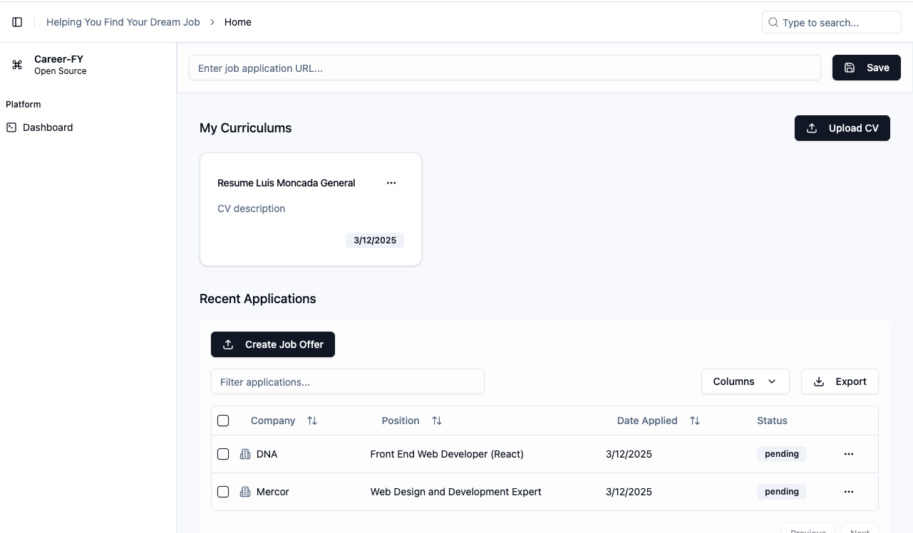

A AI Cover Letter Generator. This project allows the user to generate a cover letter for a job application. The user can generate a cover letter for a job application by uploading their resume and the job description. The project uses AI to generate the cover letter.

Github: [Career Fy](https://github.com/moncadaluisd/career-fy)

## Features

- Generate a cover letter for a job application
- Upload a resume and a job description
- Use AI to generate the cover letter
- Download the cover letter

## Technologies

- Express.js
- JavaScript
- Shadcn UI
- Tailwind CSS
- OpenAI API
- React
- TypeScript
- Tanstack Query
- TanStack Table
## Screenshots

