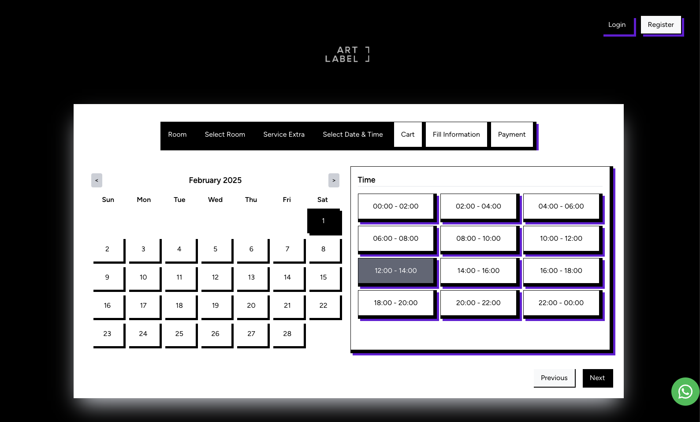
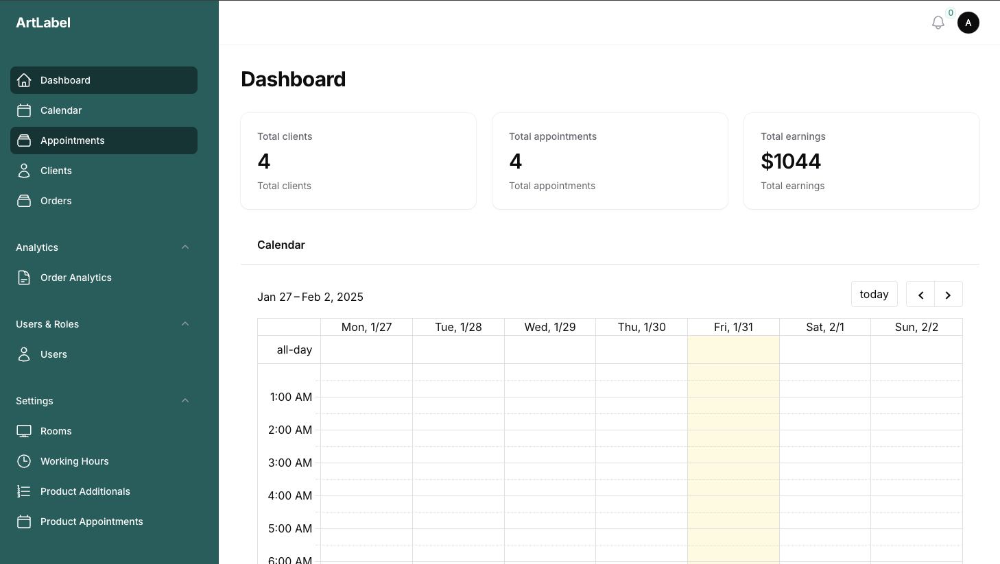
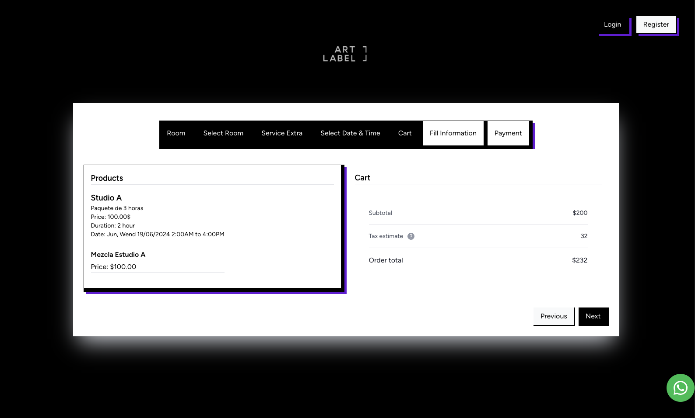
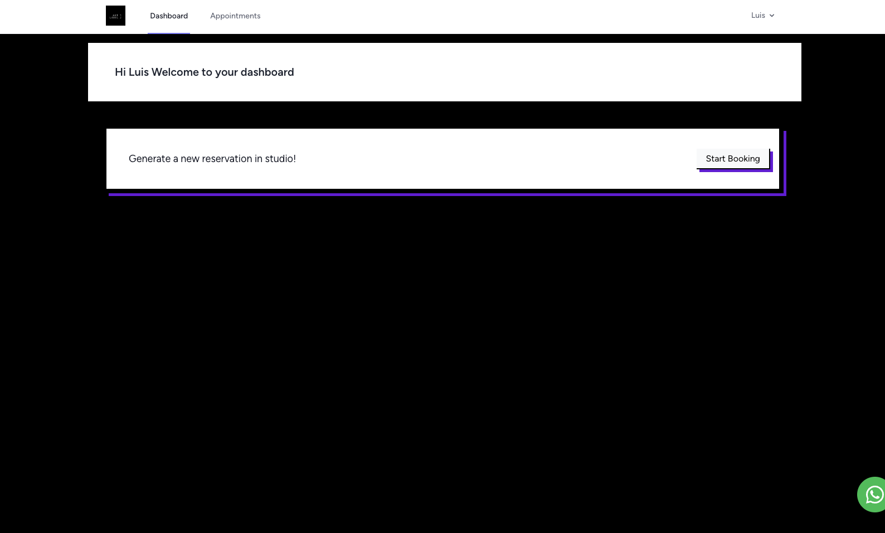
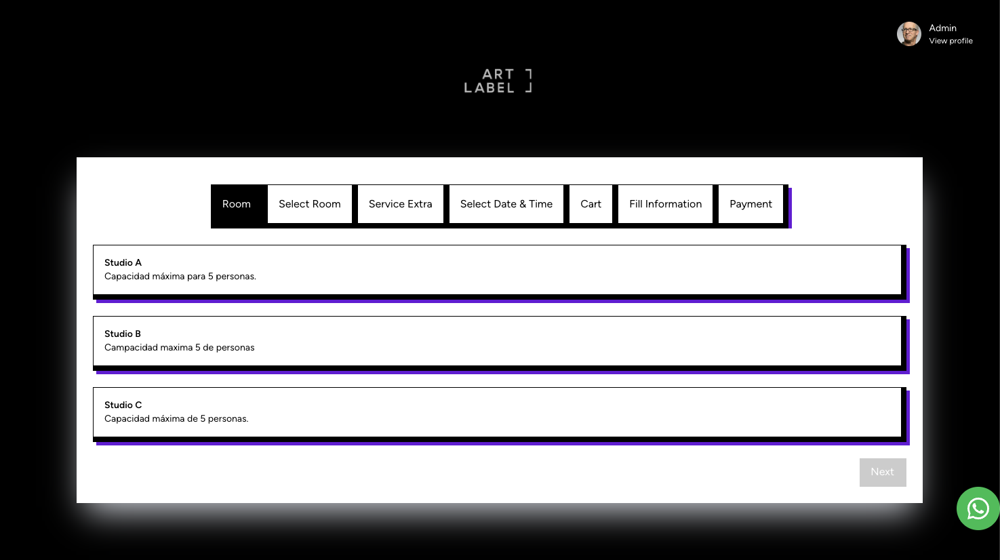
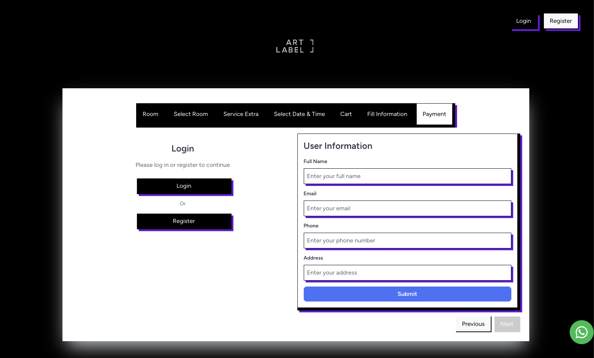

An application to schedule appointments. This project allows the user to schedule appointment and create an acount an manage their appointments. In addition allows the admin to manage the appointments and the users, with a calendar view to see the appointments and the users.

Github: [Schedule Laravel System](https://github.com/moncadaluisd/schedule-studio)

## Features

- Schedule rooms for studios
- View schedule
- Edit schedule
- Authenticated users
- Admin panel
- User panel
- Calendar view
- Appointment management
- User management
- Room management
- Payment management

## Technologies

- Laravel
- Livewire
- Tailwind CSS
- FilamentPHP

## Screenshots

